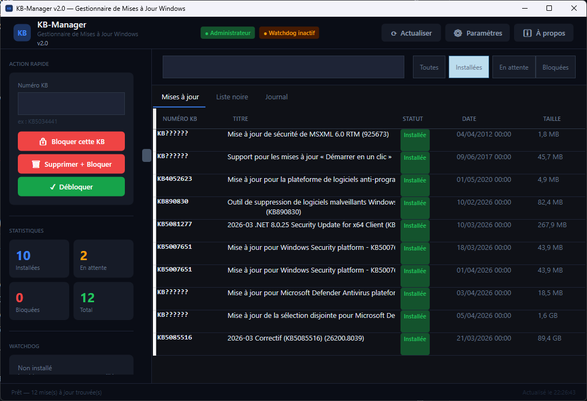

# KB-Manager — Distribution autonome

Ce fichier documente le package de publication autonome et les options de déploiement pour `KBManager`.

## Contenu du package de publication

- `kb-manager.exe`
  - exécutable autonome Windows x64
  - runtime .NET 8 inclus
  - ne nécessite pas d’installation préalable de .NET sur la machine cible
- `kb-manager.exe.sha256`
  - checksum SHA256 du binaire
  - permet de vérifier l’intégrité après transfert
- `ReadmeStandalone.md`
  - documentation pour l’utilisateur et l’intégrateur

## Objectif du package

Ce package est un artefact de distribution binaire.
Il est conçu pour être utilisé tel quel par un service d’installation, un administrateur ou un technicien sans livrer le code source.

Ne publiez pas les fichiers source, les projets `.csproj`, les scripts de build, ni les symboles de débogage.

## Prérequis

- Windows 10 ou Windows 11 x64
- droits administrateur pour les opérations de blocage/déblocage et pour l’installation du watchdog

## Installation

Ce package ne nécessite pas d’installation formelle.
Copiez simplement le contenu du dossier `KBManager` sur la machine cible.

### Exemple de déploiement

```cmd
xcopy /y /e KBManager \\serveur\partage\kb-manager-package
```

Ensuite, exécutez `.\kb-manager.exe` depuis le dossier de destination.

## Mode Interface Graphique



```cmd
.\kb-manager.exe
```

Lance l’interface WPF avec dashboard, liste des KB, liste noire, journal.

## Mode Terminal

```cmd
.\kb-manager.exe --help                      Aide rapide
.\kb-manager.exe --man                       Manuel complet paginé
.\kb-manager.exe --man --block               Manuel de la commande --block

.\kb-manager.exe --list                      Liste les KB installées
.\kb-manager.exe --list --pending            KB en attente
.\kb-manager.exe --list --blocked            KB bloquées
.\kb-manager.exe --list --output json        Sortie JSON

.\kb-manager.exe --block KB5034441           Bloque une KB
.\kb-manager.exe --block KB5034441 KB5032190 Bloc multiple
.\kb-manager.exe --unblock KB5034441         Débloque une KB
.\kb-manager.exe --remove KB5034441          Désinstalle + bloque

.\kb-manager.exe --status KB5034441          Statut détaillé
.\kb-manager.exe --watchdog install          Installe le watchdog
.\kb-manager.exe --watchdog remove           Supprime le watchdog
.\kb-manager.exe --watchdog status           État du watchdog
.\kb-manager.exe --watchdog run              Déclenche le watchdog

.\kb-manager.exe --export blocklist.json     Exporte la liste noire
.\kb-manager.exe --import blocklist.json     Importe une liste noire
.\kb-manager.exe --log                       20 derniers événements
.\kb-manager.exe --log --tail 100            100 derniers événements
```

### Options globales

- `--output table|json|csv`    Format de sortie
- `--no-color`                 Pas de couleurs ANSI
- `--quiet`                    Messages minimaux
- `--verbose`                  Détail des opérations

## Comment fonctionne le blocage

Le blocage d'une KB agit simultanément sur trois niveaux :

1. Registre Windows (niveau GPO)
   - Écriture dans `HKLM\SOFTWARE\Policies\Microsoft\Windows\WindowsUpdate`
   - C'est la même méthode qu'un administrateur réseau en entreprise via Group Policy.
   - Ce blocage persiste après redémarrage.

2. Windows Update Agent (WUA)
   - Marquage de la KB comme "cachée" via l'API COM officielle de Windows Update.
   - Identique à ce que fait Hide Update, mais en plus robuste.

3. Liste noire JSON persistante
   - Stockée dans `%APPDATA%\KB-Manager\blocklist.json`
   - Surveillée en permanence par le watchdog.

## Le Watchdog

Le watchdog est une tâche planifiée Windows qui re-applique automatiquement tous les blocages sans intervention manuelle.
Il se déclenche dans quatre situations :

- Au démarrage de Windows (30 secondes après le boot)
- Quand le service Windows Update démarre
- Après chaque installation de mise à jour détectée
- Toutes les heures (filet de sécurité)

Si Windows tente de réinstaller une KB bloquée, le watchdog la re-bloque immédiatement et envoie une alerte.

### Installation

```cmd
kb-manager.exe --watchdog install
```

### Statut

```cmd
kb-manager.exe --watchdog status
```

### Lancer immédiatement

```cmd
kb-manager.exe --watchdog run
```

### Suppression

```cmd
kb-manager.exe --watchdog remove
```

## Surveillance temps réel (mode GUI)

En mode interface graphique, KB-Manager surveille en temps réel via WMI les événements Windows Update.
Si une KB de la liste noire est détectée :

- Une fenêtre d’alerte toast apparaît en bas à droite de l’écran
- Le blocage est re-appliqué immédiatement
- L’événement est enregistré dans le journal

## Comportement du package

### Données utilisateur

Les paramètres et le journal sont stockés sous :

- `%APPDATA%\KB-Manager\blocklist.json`
- `%APPDATA%\KB-Manager\settings.json`
- `%APPDATA%\KB-Manager\kb-manager.log.json`

### Blocage des mises à jour

KB-Manager applique des blocages sur plusieurs niveaux :

- registre Windows (`HKLM\SOFTWARE\Policies\Microsoft\Windows\WindowsUpdate`)
- API Windows Update pour cacher les KB
- liste noire JSON persistante

### Transparence

Le binaire autonome est livré avec le runtime intégré.
Aucun composant externe supplémentaire n’est requis sur la machine cible.

## Vérification d’intégrité

Pour vérifier la checksum SHA256 du binaire :

```cmd
certutil -hashfile kb-manager.exe SHA256
```

Ou, si PowerShell est disponible :

```powershell
Get-FileHash -Algorithm SHA256 .\kb-manager.exe
```

Comparez le hash affiché avec le contenu de `kb-manager.exe.sha256`.

## Distribution correcte

Pour distribuer ce package, publiez uniquement :

- `kb-manager.exe`
- `kb-manager.exe.sha256`
- `ReadmeStandalone.md`

Ne publiez pas :

- le code source
- les projets et scripts de build
- les fichiers `.pdb`, `.csproj`, `.dll` de développement

## Notes importantes

- Les Feature Updates majeurs (passage 22H2 → 23H2 par exemple) peuvent contourner certains blocages registre. Le watchdog re-applique les règles automatiquement après chaque redémarrage.
- Le numéro KB peut être saisi avec ou sans le préfixe KB en mode CLI.
- Le blocage via registre GPO est identique à ce qu'utilise un administrateur réseau en entreprise. C'est la méthode la plus robuste disponible.
- KB-Manager v2.0 — C# .NET 8 WPF.
